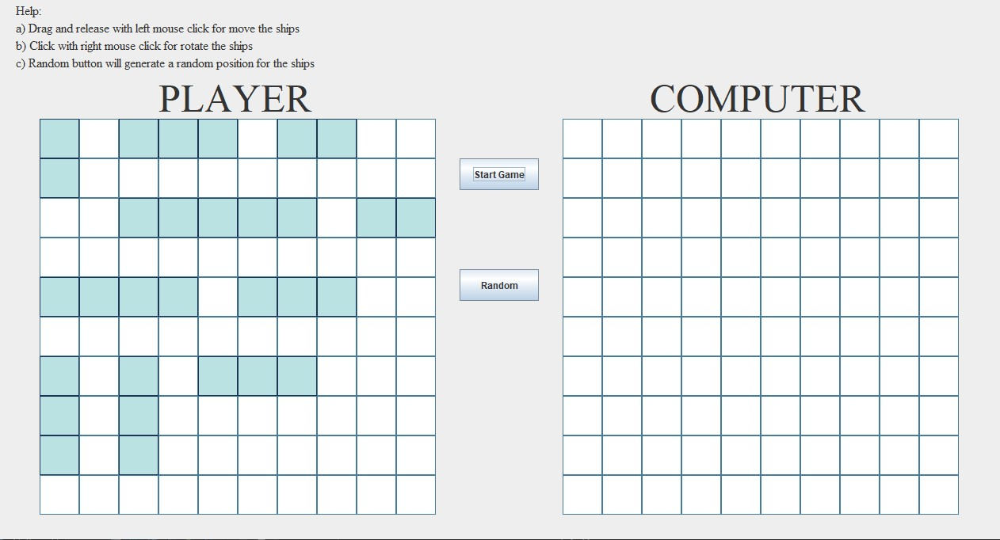

# Battaglia_Navale



# Description

The game involves two grids(player and computer) positioned in JFrame. Player grid displays player's ships set in the beginning of the game. Computer grid displays the cells that the player attacked(red for hit and gray for miss). Player take turns by clicking on the Computer grid. When the match is over with the player win the game will be displayed with congratulations pop-up message. Because of state design pattern player cannot fire more than once per turn nor player can move ships after setting them up in the beginning of the game.

* 10 Ships per player
    * 1 aircraft carrier with 5 squares
    * 1 Battleship with 4 squares
    * 2 Cruises with 3 squares
    * 3 Submarines with 3 squares
    * 3 Assault ships with 2 squares

* Grid size: 10x10 squares
* Grid interaction: Mouse 
* GUI Framework: Swing

## Usage

Terminal:

```sh
cd ...Battaglia_Navale/out
java -jar Battleship.jar
```